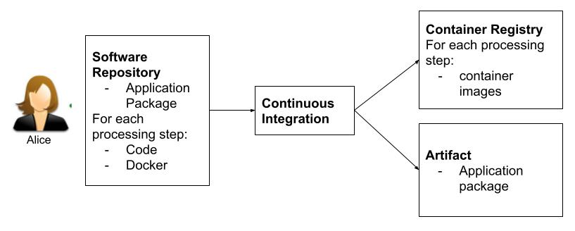
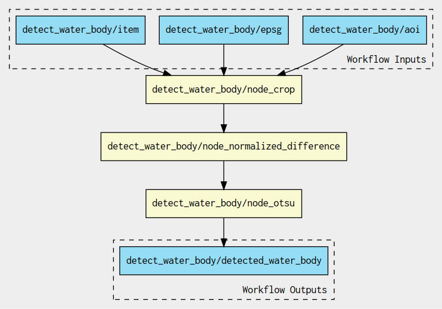

### Water bodies detection Application Package development and test


**Alice implements the application package**



This Application Package takes as input Copernicus Sentinel-2 data and detects water bodies by applying the Otsu thresholding technique on the Normalized Difference Water Index (NDWI).

The NDWI is calculated with: 

$$
NDWI = { (green - nir) \over (green + nir) } 
$$

Typically, NDWI values of water bodies are larger than 0.2 and built-up features have positive values between 0 and 0.2.

Vegetation has much smaller NDWI values, which results in distinguishing vegetation from water bodies easier. 

The NDWI values correspond to the following ranges:

| Range       | Description                            |
| ----------- | -------------------------------------- |
| 0,2 - 1     | Water surface                          |
| 0.0 - 0,2   | Flooding, humidity                     |
| -0,3 - 0.0  | Moderate drought, non-aqueous surfaces |
| -1 - -0.3   | Drought, non-aqueous surfaces          |

To ease the determination of the water surface/non water surface, the Ostu thresholding technique is used. 

In the simplest form, the Otsu algorithm returns a single intensity threshold that separate pixels into two classes, foreground and background. This threshold is determined by minimizing intra-class intensity variance, or equivalently, by maximizing inter-class variance:


The Water Bodies detection steps are depicted below:

``` mermaid
graph TB
  A[STAC Items] --> B
  A[STAC Items] --> C
subgraph Process STAC item
  B["crop(green)"] --> D[Normalized difference];
  C["crop(nir)"] --> D[Normalized difference];
  D --> E[Otsu threshold]
end
  E --> F[Create STAC]
```

The application takes a list of Sentinel-2 STAC items references, applies the crop over the area of interest for the radiometric bands green and NIR, the normalized difference, the Ostu threshold and finaly creates a STAC catalog and items for the generated results.

Alice organizes the Application Package to include a macro workflow that reads the list of Sentinel-2 STAC items references, launches a sub-workflow to detect the water bodies and creates the STAC catalog:


The sub-workflow applies the  `crop`, `Normalized difference`, `Otsu threshold` steps:




The development and test dataset is made of two Sentinel-2 acquisitions:

| Acquisitions 	|                                                                                                                                       	|                                                                                                                                       	|
|--------------	|---------------------------------------------------------------------------------------------------------------------------------------	|---------------------------------------------------------------------------------------------------------------------------------------	|
| Date         	|                                                               2021-07-13                                                              	|                                                               2022-05-24                                                              	|
| URL          	| [S2B_10TFK_20210713_0_L2A](https://earth-search.aws.element84.com/v0/collections/sentinel-s2-l2a-cogs/items/S2B_10TFK_20210713_0_L2A) 	| [S2A_10TFK_20220524_0_L2A](https://earth-search.aws.element84.com/v0/collections/sentinel-s2-l2a-cogs/items/S2A_10TFK_20220524_0_L2A) 	|
| Quicklook    	|                                          	|                                          	|

Alice uses an IDE to implement and test the application. 

Each `Command Line Tool` step such as `crop`, `Normalized difference`, `Otsu threshold` and `Create STAC` runs a Python script in a dedicated container.

#### Hands-on

<a href="https://mybinder.org/v2/gh/cwl-for-eo/vscode-binder/master?urlpath=git-pull%3Frepo%3Dhttps%253A%252F%252Fgithub.com%252FTerradue%252Fogc-eo-application-package-hands-on%26urlpath%3D%252Fvscode%252F%253Ffolder%253D%252Fhome%252Fjovyan%252Fogc-eo-application-package-hands-on%252Fwater-bodies%26branch%3Dmaster" target="_blank"></img></a> 

Once the Code Server instance is up, open a new Terminal and create the Python environments to run the Application Package steps:

```console
mamba create -c conda-forge -y -p /srv/conda/envs/env_crop  gdal click pystac 
mamba create -c conda-forge -y -p /srv/conda/envs/env_norm_diff click gdal  
mamba create -c conda-forge -y -p /srv/conda/envs/env_otsu gdal scikit-image click 
mamba create -c conda-forge -y -p /srv/conda/envs/env_stac click pystac python=3.9 pip && \
    /srv/conda/envs/env_stac/bin/pip install rio_stac
mamba clean --all -f -y
```
This configuration step takes a few minutes to complete and prints:

```
jovyan@jupyter-cwl-2dfor-2deo-2dvscode-2dbinder-2dv5n1yyn4:~/ogc-eo-application-package-hands-on/water-bodies$ mamba create -c conda-forge -y -p /srv/conda/envs/env_crop  gdal click pystac 
-forge -y -p /srv/conda/envs/env_norm_diff click gdal  
mamba create -c conda-forge -y -p /srv/conda/envs/env_otsu gdal scikit-image click 
mamba create -c conda-forge -y -p /srv/conda/envs/env_stac click pystac python=3.9 pip && \
    /srv/conda/envs/env_stac/bin/pip install rio_stac
mamba clean --all -f -y
                  __    __    __    __
                 /  \  /  \  /  \  /  \
                /    \/    \/    \/    \
███████████████/  /██/  /██/  /██/  /████████████████████████
              /  / \   / \   / \   / \  \____
             /  /   \_/   \_/   \_/   \    o \__,
            / _/                       \_____/  `
            |/
        ███╗   ███╗ █████╗ ███╗   ███╗██████╗  █████╗
        ████╗ ████║██╔══██╗████╗ ████║██╔══██╗██╔══██╗
        ██╔████╔██║███████║██╔████╔██║██████╔╝███████║
        ██║╚██╔╝██║██╔══██║██║╚██╔╝██║██╔══██╗██╔══██║
        ██║ ╚═╝ ██║██║  ██║██║ ╚═╝ ██║██████╔╝██║  ██║
        ╚═╝     ╚═╝╚═╝  ╚═╝╚═╝     ╚═╝╚═════╝ ╚═╝  ╚═╝

        mamba (1.2.0) supported by @QuantStack

        GitHub:  https://github.com/mamba-org/mamba
        Twitter: https://twitter.com/QuantStack

█████████████████████████████████████████████████████████████
...

...

Will remove 1 package cache(s).
```

#### Code inspection

Get yourself familiar with what the command line tools do when invoked.

1. Inspect each of the command line tools `crop`, `norm_diff`, `otsu` and `stac` Python script
2. Inspect each of the `Dockerfile` 

#### Application Package execution

1. Go to `Terminal` to open a new terminal
2. Run the water bodies detection Application Package with: 

```
cwltool --no-container app-package.cwl#water_bodies params.yml > out.json
```

`cwltool` is a Common Workflow Language runner. 

The flag `--no-container` is used to instruct `cwltool` to use the local command-line tools instead of using the containers as Binder cannot launch containers.

`app-package.cwl#water_bodies` defines the CWL file to execute and instructs `cwltool` which element to run. Here it's the `Workflow` with the id `water_bodies`.

The file `params.yml` contains the parameters:

```
stac_items:
- "https://earth-search.aws.element84.com/v0/collections/sentinel-s2-l2a-cogs/items/S2B_10TFK_20210713_0_L2A"
- "https://earth-search.aws.element84.com/v0/collections/sentinel-s2-l2a-cogs/items/S2A_10TFK_20220524_0_L2A"

aoi: "-121.399,39.834,-120.74,40.472"
epsg: "EPSG:4326"
```

The `cwltool` execution prints: 

```console
jovyan@jupyter-cwl-2dfor-2deo-2dvscode-2dbinder-2dv5n1yyn4:~/ogc-eo-application-package-hands-on/water-bodies$ cwltool --no-container app-package.cwl#water_bodies params.yml > out.json
INFO /srv/conda/envs/notebook/bin/cwltool 3.1.20221201130942
INFO Resolved 'app-package.cwl#water_bodies' to 'file:///home/jovyan/ogc-eo-application-package-hands-on/water-bodies/app-package.cwl#water_bodies'
INFO [workflow ] start
INFO [workflow ] starting step node_water_bodies
INFO [step node_water_bodies] start
INFO [workflow node_water_bodies] start
INFO [workflow node_water_bodies] starting step node_crop
INFO [step node_crop] start
INFO [job node_crop] /tmp/hgboee9w$ python \
    -m \
    app \
    --aoi \
    -121.399,39.834,-120.74,40.472 \
    --band \
    green \
    --epsg \
    EPSG:4326 \
    --input-item \
    https://earth-search.aws.element84.com/v0/collections/sentinel-s2-l2a-cogs/items/S2B_10TFK_20210713_0_L2A
INFO [job node_crop] Max memory used: 67MiB
INFO [job node_crop] completed success
...

...
INFO [workflow ] starting step node_stac
INFO [step node_stac] start
INFO [job node_stac] /tmp/l9b37lie$ python \
    -m \
    app \
    --input-item \
    https://earth-search.aws.element84.com/v0/collections/sentinel-s2-l2a-cogs/items/S2B_10TFK_20210713_0_L2A \
    --water-body \
    /tmp/3_ithdmj/stg6a24fafc-7f9f-498a-b0c8-259811c7c959/otsu.tif \
    --input-item \
    https://earth-search.aws.element84.com/v0/collections/sentinel-s2-l2a-cogs/items/S2A_10TFK_20220524_0_L2A \
    --water-body \
    /tmp/3_ithdmj/stg5a6afa0d-1926-4256-83f1-c5f7ba4edeab/otsu.tif
INFO [job node_stac] Max memory used: 47MiB
INFO [job node_stac] completed success
INFO [step node_stac] completed success
INFO [workflow ] completed success
INFO Final process status is success
```

Once the workflow execution is completed, there's a folder with the results generated.

The JSON file `out.json` is a manifest containing the listing of the results included in that folder:


```json
{
    "stac_catalog": {
        "location": "file:///home/jovyan/ogc-eo-application-package-hands-on/water-bodies/l9b37lie",
        "basename": "l9b37lie",
        "class": "Directory",
        "listing": [
            {
                "class": "Directory",
                "location": "file:///home/jovyan/ogc-eo-application-package-hands-on/water-bodies/l9b37lie/S2A_10TFK_20220524_0_L2A",
                "basename": "S2A_10TFK_20220524_0_L2A",
                "listing": [
                    {
                        "class": "File",
                        "location": "file:///home/jovyan/ogc-eo-application-package-hands-on/water-bodies/l9b37lie/S2A_10TFK_20220524_0_L2A/S2A_10TFK_20220524_0_L2A.json",
                        "basename": "S2A_10TFK_20220524_0_L2A.json",
                        "checksum": "sha1$de27e30c1e40ac0c2cb41f66f25e0258f4a6fdbc",
                        "size": 4870,
                        "path": "/home/jovyan/ogc-eo-application-package-hands-on/water-bodies/l9b37lie/S2A_10TFK_20220524_0_L2A/S2A_10TFK_20220524_0_L2A.json"
                    },
                    {
                        "class": "File",
                        "location": "file:///home/jovyan/ogc-eo-application-package-hands-on/water-bodies/l9b37lie/S2A_10TFK_20220524_0_L2A/otsu.tif",
                        "basename": "otsu.tif",
                        "checksum": "sha1$f8b7daf9c86b0271a813a0948e0edb947e5f2773",
                        "size": 175932,
                        "path": "/home/jovyan/ogc-eo-application-package-hands-on/water-bodies/l9b37lie/S2A_10TFK_20220524_0_L2A/otsu.tif"
                    }
                ],
                "path": "/home/jovyan/ogc-eo-application-package-hands-on/water-bodies/l9b37lie/S2A_10TFK_20220524_0_L2A"
            },
            {
                "class": "File",
                "location": "file:///home/jovyan/ogc-eo-application-package-hands-on/water-bodies/l9b37lie/catalog.json",
                "basename": "catalog.json",
                "checksum": "sha1$f7214df9b2be4df8b704b4bbe73cdf76b30b0ca6",
                "size": 525,
                "path": "/home/jovyan/ogc-eo-application-package-hands-on/water-bodies/l9b37lie/catalog.json"
            },
            {
                "class": "Directory",
                "location": "file:///home/jovyan/ogc-eo-application-package-hands-on/water-bodies/l9b37lie/S2B_10TFK_20210713_0_L2A",
                "basename": "S2B_10TFK_20210713_0_L2A",
                "listing": [
                    {
                        "class": "File",
                        "location": "file:///home/jovyan/ogc-eo-application-package-hands-on/water-bodies/l9b37lie/S2B_10TFK_20210713_0_L2A/S2B_10TFK_20210713_0_L2A.json",
                        "basename": "S2B_10TFK_20210713_0_L2A.json",
                        "checksum": "sha1$fe3860a19aabba59561d1410070e1a2378769b4a",
                        "size": 4870,
                        "path": "/home/jovyan/ogc-eo-application-package-hands-on/water-bodies/l9b37lie/S2B_10TFK_20210713_0_L2A/S2B_10TFK_20210713_0_L2A.json"
                    },
                    {
                        "class": "File",
                        "location": "file:///home/jovyan/ogc-eo-application-package-hands-on/water-bodies/l9b37lie/S2B_10TFK_20210713_0_L2A/otsu.tif",
                        "basename": "otsu.tif",
                        "checksum": "sha1$4bc4935a02b7de7d2460d05b3a3c4bf92557b8d3",
                        "size": 99746,
                        "path": "/home/jovyan/ogc-eo-application-package-hands-on/water-bodies/l9b37lie/S2B_10TFK_20210713_0_L2A/otsu.tif"
                    }
                ],
                "path": "/home/jovyan/ogc-eo-application-package-hands-on/water-bodies/l9b37lie/S2B_10TFK_20210713_0_L2A"
            }
        ],
        "path": "/home/jovyan/ogc-eo-application-package-hands-on/water-bodies/l9b37lie"
    }
}
```

#### Result inspection

If you're running the Hands-on on Binder, you can inspect and plt the results with a Jupyter Notebook.

The results are inspected and visualized with the `visualization.ipynb` notebook on [JupyterLab](../../../../lab) by running all cells. This notebook uses pystac to access the geotiffs produced, leafmap to plot the tiles served by a local tile server.

Technically, the notebook parses the results produced looking for the STAC Catalog file `catalog.json` and adds the STAC items' `data` asset on the map.


