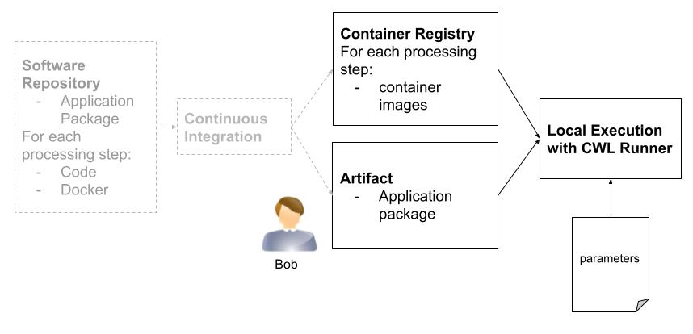

### Water bodies detection Application Package scripted execution

**Bob scripts the execution of the Application package**



Alice included in the water bodies detection Application Package software repository a Continuous Integration configuration relying on Github Actions to:

* build the containers
* push the built containers to Github container registry
* update the Application Package with these new container references
* push the updated Application Package to Github's artifact registry

Bob scripts the Application Execution. His environment has a container engine (e.g. docker) and the `cwltool` CWL runner.

#### Execution

Bob checks latest Water bodies detection Application Package pushed by the Continuous Integration to the [releases](https://github.com/Terradue/ogc-eo-application-package-hands-on/releases) and either downloads the Application Package or runs it with an URL to a release.

Bob uses an input dataset with two Sentinel-2 acquisitions:

| Acquisitions 	|                                                                                                                                       	|                                                                                                                                       	|
|--------------	|---------------------------------------------------------------------------------------------------------------------------------------	|---------------------------------------------------------------------------------------------------------------------------------------	|
| Date         	|                                                               2021-07-13                                                              	|                                                               2022-05-24                                                              	|
| URL          	| [S2B_10TFK_20210713_0_L2A](https://earth-search.aws.element84.com/v0/collections/sentinel-s2-l2a-cogs/items/S2B_10TFK_20210713_0_L2A) 	| [S2A_10TFK_20220524_0_L2A](https://earth-search.aws.element84.com/v0/collections/sentinel-s2-l2a-cogs/items/S2A_10TFK_20220524_0_L2A) 	|
| Quicklook    	|                                          	|                                          	|

#### Hands-on

<a href="https://mybinder.org/v2/gh/cwl-for-eo/vscode-binder/master?urlpath=git-pull%3Frepo%3Dhttps%253A%252F%252Fgithub.com%252FTerradue%252Fogc-eo-application-package-hands-on%26urlpath%3D%252Fvscode%252F%253Ffolder%253D%252Fhome%252Fjovyan%252Fogc-eo-application-package-hands-on%252Fscripted-execution%26branch%3Dmaster" target="_blank"></img></a> 

Once the Code Server instance is up, open a new Terminal and create the Python environments to run the Application Package steps:

```console
mamba create -c conda-forge -y -p /srv/conda/envs/env_crop  gdal click pystac 
mamba create -c conda-forge -y -p /srv/conda/envs/env_norm_diff click gdal  
mamba create -c conda-forge -y -p /srv/conda/envs/env_otsu gdal scikit-image click 
mamba create -c conda-forge -y -p /srv/conda/envs/env_stac click pystac python=3.9 pip && \
    /srv/conda/envs/env_stac/bin/pip install rio_stac
mamba clean --all -f -y
```
This configuration step takes a few minutes to complete and prints:

```
jovyan@jupyter-cwl-2dfor-2deo-2dvscode-2dbinder-2dv5n1yyn4:~/ogc-eo-application-package-hands-on/water-bodies$ mamba create -c conda-forge -y -p /srv/conda/envs/env_crop  gdal click pystac 
-forge -y -p /srv/conda/envs/env_norm_diff click gdal  
mamba create -c conda-forge -y -p /srv/conda/envs/env_otsu gdal scikit-image click 
mamba create -c conda-forge -y -p /srv/conda/envs/env_stac click pystac python=3.9 pip && \
    /srv/conda/envs/env_stac/bin/pip install rio_stac
mamba clean --all -f -y
                  __    __    __    __
                 /  \  /  \  /  \  /  \
                /    \/    \/    \/    \
███████████████/  /██/  /██/  /██/  /████████████████████████
              /  / \   / \   / \   / \  \____
             /  /   \_/   \_/   \_/   \    o \__,
            / _/                       \_____/  `
            |/
        ███╗   ███╗ █████╗ ███╗   ███╗██████╗  █████╗
        ████╗ ████║██╔══██╗████╗ ████║██╔══██╗██╔══██╗
        ██╔████╔██║███████║██╔████╔██║██████╔╝███████║
        ██║╚██╔╝██║██╔══██║██║╚██╔╝██║██╔══██╗██╔══██║
        ██║ ╚═╝ ██║██║  ██║██║ ╚═╝ ██║██████╔╝██║  ██║
        ╚═╝     ╚═╝╚═╝  ╚═╝╚═╝     ╚═╝╚═════╝ ╚═╝  ╚═╝

        mamba (1.2.0) supported by @QuantStack

        GitHub:  https://github.com/mamba-org/mamba
        Twitter: https://twitter.com/QuantStack

█████████████████████████████████████████████████████████████
...

...

Will remove 1 package cache(s).
```

Open a Terminal and run:

```
python bob.py
```

This will print:

```
INFO bob.py 3.1.20221201130942
INFO [workflow ] start
INFO [workflow ] starting step node_water_bodies
INFO [step node_water_bodies] start
INFO [workflow node_water_bodies] start
INFO [workflow node_water_bodies] starting step node_crop
INFO [step node_crop] start
INFO [job node_crop] /tmp/6n8apsoq$ python \
    -m \
    app \
    --aoi \
    -121.399,39.834,-120.74,40.472 \
    --band \
    green \
    --epsg \
    EPSG:4326 \
    --input-item \
    https://earth-search.aws.element84.com/v0/collections/sentinel-s2-l2a-cogs/items/S2B_10TFK_20210713_0_L2A
INFO [job node_crop] Max memory used: 67MiB
INFO [job node_crop] completed success
INFO [step node_crop] start
INFO [job node_crop_2] /tmp/k_9lm8he$ python \
    -m \
    app \
    --aoi \
    -121.399,39.834,-120.74,40.472 \
    --band \
    nir \
    --epsg \
    EPSG:4326 \
    --input-item \
    https://earth-search.aws.element84.com/v0/collections/sentinel-s2-l2a-cogs/items/S2B_10TFK_20210713_0_L2A
INFO [job node_crop_2] Max memory used: 66MiB
INFO [job node_crop_2] completed success
INFO [step node_crop] completed success
INFO [workflow node_water_bodies] starting step node_normalized_difference
INFO [step node_normalized_difference] start
INFO [job node_normalized_difference] /tmp/gksmem7n$ python \
    -m \
    app \
    /tmp/17glpf06/stgb6188a88-313c-4c6c-a97b-b485c4394cb3/crop_green.tif \
    /tmp/17glpf06/stgadfebda3-fff9-4bd4-bb96-2b79c812bf23/crop_nir.tif
INFO [job node_normalized_difference] Max memory used: 273MiB
INFO [job node_normalized_difference] completed success
INFO [step node_normalized_difference] completed success
INFO [workflow node_water_bodies] starting step node_otsu
INFO [step node_otsu] start
INFO [job node_otsu] /tmp/ir5klrom$ python \
    -m \
    app \
    /tmp/no594xke/stg7ff1069c-3ee3-4d42-bcd7-ccf82205eb58/norm_diff.tif
INFO [job node_otsu] Max memory used: 60MiB
INFO [job node_otsu] completed success
INFO [step node_otsu] completed success
INFO [workflow node_water_bodies] completed success
INFO [step node_water_bodies] start
INFO [workflow node_water_bodies_2] start
INFO [workflow node_water_bodies_2] starting step node_crop_2
INFO [step node_crop_2] start
INFO [job node_crop_3] /tmp/0ocyq5md$ python \
    -m \
    app \
    --aoi \
    -121.399,39.834,-120.74,40.472 \
    --band \
    green \
    --epsg \
    EPSG:4326 \
    --input-item \
    https://earth-search.aws.element84.com/v0/collections/sentinel-s2-l2a-cogs/items/S2A_10TFK_20220524_0_L2A
INFO [job node_crop_3] Max memory used: 67MiB
INFO [job node_crop_3] completed success
INFO [step node_crop_2] start
INFO [job node_crop_4] /tmp/u0uvyo87$ python \
    -m \
    app \
    --aoi \
    -121.399,39.834,-120.74,40.472 \
    --band \
    nir \
    --epsg \
    EPSG:4326 \
    --input-item \
    https://earth-search.aws.element84.com/v0/collections/sentinel-s2-l2a-cogs/items/S2A_10TFK_20220524_0_L2A
INFO [job node_crop_4] Max memory used: 66MiB
INFO [job node_crop_4] completed success
INFO [step node_crop_2] completed success
INFO [workflow node_water_bodies_2] starting step node_normalized_difference_2
INFO [step node_normalized_difference_2] start
INFO [job node_normalized_difference_2] /tmp/klj25q69$ python \
    -m \
    app \
    /tmp/it1t00w7/stgad3e6991-667e-4726-894f-7719d56020de/crop_green.tif \
    /tmp/it1t00w7/stgc43022ad-babd-479e-98c2-61f5c1bd25fa/crop_nir.tif
INFO [job node_normalized_difference_2] Max memory used: 781MiB
INFO [job node_normalized_difference_2] completed success
INFO [step node_normalized_difference_2] completed success
INFO [workflow node_water_bodies_2] starting step node_otsu_2
INFO [step node_otsu_2] start
INFO [job node_otsu_2] /tmp/3p5hbt32$ python \
    -m \
    app \
    /tmp/ftopy3mv/stgc969ba01-2f50-4035-b946-d693680cbb7c/norm_diff.tif
INFO [job node_otsu_2] Max memory used: 58MiB
INFO [job node_otsu_2] completed success
INFO [step node_otsu_2] completed success
INFO [workflow node_water_bodies_2] completed success
INFO [step node_water_bodies] completed success
INFO [workflow ] starting step node_stac
INFO [step node_stac] start
INFO [job node_stac] /tmp/37zde3p4$ python \
    -m \
    app \
    --input-item \
    https://earth-search.aws.element84.com/v0/collections/sentinel-s2-l2a-cogs/items/S2B_10TFK_20210713_0_L2A \
    --water-body \
    /tmp/fd0l65gi/stg9de20acd-1158-4ac3-be6d-a30e00996fd3/otsu.tif \
    --input-item \
    https://earth-search.aws.element84.com/v0/collections/sentinel-s2-l2a-cogs/items/S2A_10TFK_20220524_0_L2A \
    --water-body \
    /tmp/fd0l65gi/stg8bc3674f-f313-4f79-9dee-5a3bb454f2fb/otsu.tif
INFO [job node_stac] Max memory used: 58MiB
INFO [job node_stac] completed success
INFO [step node_stac] completed success
INFO [workflow ] completed success
INFO Final process status is success
* <Catalog id=catalog>
  * <Item id=S2B_10TFK_20210713_0_L2A>
  * <Item id=S2A_10TFK_20220524_0_L2A>
```

#### Execution with containers - requires docker
 
The file `params.yml` contains the parameters:

```
stac_items:
- "https://earth-search.aws.element84.com/v0/collections/sentinel-s2-l2a-cogs/items/S2B_10TFK_20210713_0_L2A"
- "https://earth-search.aws.element84.com/v0/collections/sentinel-s2-l2a-cogs/items/S2A_10TFK_20220524_0_L2A"

aoi: "-121.399,39.834,-120.74,40.472"
epsg: "EPSG:4326"
```

Then

```
cwltool https://github.com/Terradue/ogc-eo-application-package-hands-on/releases/download/1.1.6/app-water-bodies.1.1.6.cwl#water_bodies params.yml
```

**Note** `#water_bodies` is the anchor for the entry point in the Application Package.

This triggers the Application Package execution and it will print:

```
$ cwltool https://github.com/Terradue/ogc-eo-application-package-hands-on/releases/download/1.1.6/app-water-bodies.1.1.6.cwl#water_bodies water-bodies/params.yml
[2023-01-17 08:56:05] INFO /srv/conda/bin/cwltool 3.1.20221027224946
[2023-01-17 08:56:07] INFO [workflow ] start
[2023-01-17 08:56:07] INFO [workflow ] starting step node_water_bodies
[2023-01-17 08:56:07] INFO [step node_water_bodies] start
[2023-01-17 08:56:07] INFO [workflow node_water_bodies] start
[2023-01-17 08:56:07] INFO [workflow node_water_bodies] starting step node_crop
[2023-01-17 08:56:07] INFO [step node_crop] start
[2023-01-17 08:56:07] INFO ['docker', 'pull', 'ghcr.io/terradue/ogc-eo-application-package-hands-on/crop:1.1.6']
1.1.6: Pulling from terradue/ogc-eo-application-package-hands-on/crop
a603fa5e3b41: Already exists 
f4e6c07683b9: Pull complete 
c8d9f3f6fdb9: Pull complete 
a54a0971e64a: Pull complete 
a4a2977839e7: Pull complete 
02c6daa3b749: Pull complete 
4f4fb700ef54: Pull complete 
86f40045fa70: Pull complete 
828182a9456e: Pull complete 
9a8388eaf351: Pull complete 
d22e3d657f8a: Pull complete 
94131a1ca8d1: Pull complete 
f294e065ad00: Pull complete 
eae1e9c88d17: Pull complete 
915c6c1827e8: Pull complete 
e26bfec68ea6: Pull complete 
26b76c6b56da: Pull complete 
Digest: sha256:b9d24d2467448a401ea62e8b2e258a10a36dcd4a8a412554e134686631ab6dbb
Status: Downloaded newer image for ghcr.io/terradue/ogc-eo-application-package-hands-on/crop:1.1.6
ghcr.io/terradue/ogc-eo-application-package-hands-on/crop:1.1.6
[2023-01-17 08:57:54] WARNING [job node_crop] Skipping Docker software container '--memory' limit despite presence of ResourceRequirement with ramMin and/or ramMax setting. Consider running with --strict-memory-limit for increased portability assurance.
[2023-01-17 08:57:54] WARNING [job node_crop] Skipping Docker software container '--cpus' limit despite presence of ResourceRequirement with coresMin and/or coresMax setting. Consider running with --strict-cpu-limit for increased portability assurance.
[2023-01-17 08:57:54] INFO [job node_crop] /tmp/d_p8fm89$ docker \
    run \
    -i \
    --mount=type=bind,source=/tmp/d_p8fm89,target=/UqhtEY \
    --mount=type=bind,source=/tmp/n1td4efj,target=/tmp \
    --workdir=/UqhtEY \
    --read-only=true \
    --user=1000:1000 \
    --rm \
    --cidfile=/tmp/2ssyfxjr/20230117085754-446538.cid \
    --env=TMPDIR=/tmp \
    --env=HOME=/UqhtEY \
    --env=PATH=/srv/conda/envs/env_crop/bin:/usr/local/sbin:/usr/local/bin:/usr/sbin:/usr/bin:/sbin:/bin \
    --env=PROJ_LIB=/srv/conda/envs/env_crop/share/proj/ \
    --env=PYTHONPATH=/workspaces/vscode-binder/command-line-tools/crop:/home/jovyan/water-bodies/command-line-tools/crop \
    ghcr.io/terradue/ogc-eo-application-package-hands-on/crop:1.1.6 \
    python \
    -m \
    app \
    --aoi \
    -121.399,39.834,-120.74,40.472 \
    --band \
    green \
    --epsg \
    EPSG:4326 \
    --input-item \
    https://earth-search.aws.element84.com/v0/collections/sentinel-s2-l2a-cogs/items/S2B_10TFK_20210713_0_L2A
[2023-01-17 08:58:35] INFO [job node_crop] Max memory used: 236MiB
[2023-01-17 08:58:35] INFO [job node_crop] completed success
...
```

To finally print a manifest with the files and directories produced:

```json
{
    "stac_catalog": {
        "location": "file:///data/work/ogc-eo-application-package-hands-on/vm8zy5nm",
        "basename": "vm8zy5nm",
        "class": "Directory",
        "listing": [
            {
                "class": "Directory",
                "location": "file:///data/work/ogc-eo-application-package-hands-on/vm8zy5nm/S2A_10TFK_20220524_0_L2A",
                "basename": "S2A_10TFK_20220524_0_L2A",
                "listing": [
                    {
                        "class": "File",
                        "location": "file:///data/work/ogc-eo-application-package-hands-on/vm8zy5nm/S2A_10TFK_20220524_0_L2A/S2A_10TFK_20220524_0_L2A.json",
                        "basename": "S2A_10TFK_20220524_0_L2A.json",
                        "checksum": "sha1$de27e30c1e40ac0c2cb41f66f25e0258f4a6fdbc",
                        "size": 4870,
                        "path": "/data/work/ogc-eo-application-package-hands-on/vm8zy5nm/S2A_10TFK_20220524_0_L2A/S2A_10TFK_20220524_0_L2A.json"
                    },
                    {
                        "class": "File",
                        "location": "file:///data/work/ogc-eo-application-package-hands-on/vm8zy5nm/S2A_10TFK_20220524_0_L2A/otsu.tif",
                        "basename": "otsu.tif",
                        "checksum": "sha1$f8b7daf9c86b0271a813a0948e0edb947e5f2773",
                        "size": 175932,
                        "path": "/data/work/ogc-eo-application-package-hands-on/vm8zy5nm/S2A_10TFK_20220524_0_L2A/otsu.tif"
                    }
                ],
                "path": "/data/work/ogc-eo-application-package-hands-on/vm8zy5nm/S2A_10TFK_20220524_0_L2A"
            },
            {
                "class": "Directory",
                "location": "file:///data/work/ogc-eo-application-package-hands-on/vm8zy5nm/S2B_10TFK_20210713_0_L2A",
                "basename": "S2B_10TFK_20210713_0_L2A",
                "listing": [
                    {
                        "class": "File",
                        "location": "file:///data/work/ogc-eo-application-package-hands-on/vm8zy5nm/S2B_10TFK_20210713_0_L2A/S2B_10TFK_20210713_0_L2A.json",
                        "basename": "S2B_10TFK_20210713_0_L2A.json",
                        "checksum": "sha1$fe3860a19aabba59561d1410070e1a2378769b4a",
                        "size": 4870,
                        "path": "/data/work/ogc-eo-application-package-hands-on/vm8zy5nm/S2B_10TFK_20210713_0_L2A/S2B_10TFK_20210713_0_L2A.json"
                    },
                    {
                        "class": "File",
                        "location": "file:///data/work/ogc-eo-application-package-hands-on/vm8zy5nm/S2B_10TFK_20210713_0_L2A/otsu.tif",
                        "basename": "otsu.tif",
                        "checksum": "sha1$4bc4935a02b7de7d2460d05b3a3c4bf92557b8d3",
                        "size": 99746,
                        "path": "/data/work/ogc-eo-application-package-hands-on/vm8zy5nm/S2B_10TFK_20210713_0_L2A/otsu.tif"
                    }
                ],
                "path": "/data/work/ogc-eo-application-package-hands-on/vm8zy5nm/S2B_10TFK_20210713_0_L2A"
            },
            {
                "class": "File",
                "location": "file:///data/work/ogc-eo-application-package-hands-on/vm8zy5nm/catalog.json",
                "basename": "catalog.json",
                "checksum": "sha1$f7214df9b2be4df8b704b4bbe73cdf76b30b0ca6",
                "size": 525,
                "path": "/data/work/ogc-eo-application-package-hands-on/vm8zy5nm/catalog.json"
            }
        ],
        "path": "/data/work/ogc-eo-application-package-hands-on/vm8zy5nm"
    }
}
```

#### Exploring the results

There is an element that lists the path to the STAC Catalog, this is the entry point to discover the results generated: 

```json
{
    "class": "File",
    "location": "file:///data/work/ogc-eo-application-package-hands-on/vm8zy5nm/catalog.json",
    "basename": "catalog.json",
    "checksum": "sha1$f7214df9b2be4df8b704b4bbe73cdf76b30b0ca6",
    "size": 525,
    "path": "/data/work/ogc-eo-application-package-hands-on/vm8zy5nm/catalog.json"
}
```

The results can be explored using Python and the [pystac library](https://pystac.readthedocs.io/en/stable/):

```python
Python 3.9.13 | packaged by conda-forge | (main, May 27 2022, 16:58:50) 
[GCC 10.3.0] on linux
Type "help", "copyright", "credits" or "license" for more information.
>>> import pystac
>>> cat = pystac.read_file("/data/work/ogc-eo-application-package-hands-on/vm8zy5nm/catalog.json")
>>> cat.describe()
* <Catalog id=catalog>
  * <Item id=S2B_10TFK_20210713_0_L2A>
  * <Item id=S2A_10TFK_20220524_0_L2A>
>>> 
```

#### Scaling-up the processing resources

The scripted execution can also be done on a kubernetes cluster using the [calrissian CWL runner](https://github.com/Duke-GCB/calrissian). 

The kubernetes setup can be supported using [From zero to CWL on Kubernetes](https://github.com/Terradue/calrissian-session). 