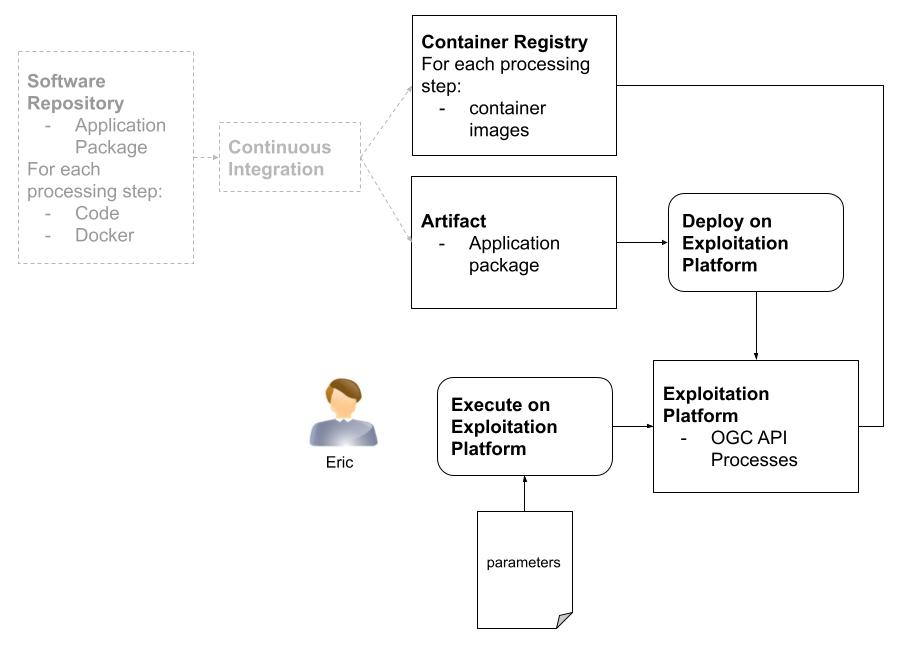

### Water bodies detection Application Package deployment and execution on a Platform

**Eric deploys the application package on a Platform**



#### Application Package deployment

Eric get Alice's Application Package latest release from [releases](https://github.com/Terradue/ogc-eo-application-package-hands-on/releases)

Eric uses `curl` to submit a POST request to an OGC API Processes endpoint to deploy the Application Package with: 

```console
curl --location --request POST 'https://myades.com/eric/wps3/processes' \
--header 'Content-Type: application/json' \
--data-raw '{
  "executionUnit": {
    "href": "https://github.com/Terradue/ogc-eo-application-package-hands-on/releases/download/1.1.6/app-water-bodies.1.1.6.cwl#water_bodies",
    "type": "application/cwl"
  }
}'
```

The output is:

```json
{
    "id": "water_bodies-1_1_6",
    "title": "Water bodies detection based on NDWI and otsu threshold",
    "description": "Water bodies detection based on NDWI and otsu threshold",
    "mutable": true,
    "version": "1.1.6",
    "outputTransmission": [
        "value",
        "reference"
    ],
    "jobControlOptions": [
        "async-execute"
    ],
    "links": [
        {
            "rel": "http://www.opengis.net/def/rel/ogc/1.0/execute",
            "type": "application/json",
            "title": "Execute End Point",
            "href": "/eric/wps3/processes/water_bodies-1_1_6/execution"
        }
    ]
}
```

The platform exposes an OGC API Processes processing service. Eric can check the newly deployed OCG API Processes process description: 

```console
curl --location --request GET 'http://myades.com/eoepca/wps3/processes/water_bodies-1_1_6' \
--header 'Content-Type: application/json'
```

The output newly deployed OCG API Processes process description:

```json
{
    "id": "water_bodies-1_1_6",
    "title": "Water bodies detection based on NDWI and otsu threshold",
    "description": "Water bodies detection based on NDWI and otsu threshold",
    "mutable": true,
    "version": "1.1.6",
    "outputTransmission": [
        "value",
        "reference"
    ],
    "jobControlOptions": [
        "async-execute"
    ],
    "links": [
        {
            "rel": "http://www.opengis.net/def/rel/ogc/1.0/execute",
            "type": "application/json",
            "title": "Execute End Point",
            "href": "/eoepca/wps3/processes/water_bodies-1_1_6/execution"
        }
    ],
    "inputs": {
        "aoi": {
            "title": "area of interest",
            "description": "area of interest as a bounding box",
            "schema": {
                "type": "string",
                "default": "Any value"
            }
        },
        "epsg": {
            "title": "EPSG code",
            "description": "EPSG code",
            "schema": {
                "type": "string",
                "default": "Any value"
            }
        },
        "stac_items": {
            "title": "Sentinel-2 STAC items",
            "description": "list of Sentinel-2 COG STAC items",
            "maxOccurs": 999,
            "schema": {
                "type": "string",
                "default": "Any value"
            }
        }
    },
    "outputs": {
        "wf_outputs": {
            "title": "wf_outputs",
            "extended-schema": {
                "oneOf": [
                    {
                        "allOf": [
                            {
                                "$ref": "http://zoo-project.org/dl/link.json"
                            },
                            {
                                "type": "object",
                                "properties": {
                                    "type": {
                                        "enum": [
                                            "application/json"
                                        ]
                                    }
                                }
                            }
                        ]
                    },
                    {
                        "type": "object",
                        "required": [
                            "value"
                        ],
                        "properties": {
                            "value": {
                                "oneOf": [
                                    {
                                        "type": "object"
                                    }
                                ]
                            }
                        }
                    }
                ]
            },
            "schema": {
                "oneOf": [
                    {
                        "type": "object"
                    }
                ]
            }
        }
    }
}
```

#### Process execution

Eric uses the input dataset with two Sentinel-2 acquisitions:

| Acquisitions 	|                                                                                                                                       	|                                                                                                                                       	|
|--------------	|---------------------------------------------------------------------------------------------------------------------------------------	|---------------------------------------------------------------------------------------------------------------------------------------	|
| Date         	|                                                               2021-07-13                                                              	|                                                               2022-05-24                                                              	|
| URL          	| [S2B_10TFK_20210713_0_L2A](https://earth-search.aws.element84.com/v0/collections/sentinel-s2-l2a-cogs/items/S2B_10TFK_20210713_0_L2A) 	| [S2A_10TFK_20220524_0_L2A](https://earth-search.aws.element84.com/v0/collections/sentinel-s2-l2a-cogs/items/S2A_10TFK_20220524_0_L2A) 	|
| Quicklook    	|                                          	|                                          	|

Eric uses `curl` to submit an execution request:

```console
curl --location --request POST 'http://myades.com/eoepca/wps3/processes/water_bodies-1_1_6/execution' \
--header 'Content-Type: application/json' \
--header 'Prefer: respond-async' \
--data-raw '{
    "inputs": {
        "stac_items": [
            "https://earth-search.aws.element84.com/v0/collections/sentinel-s2-l2a-cogs/items/S2B_10TFK_20210713_0_L2A",
            "https://earth-search.aws.element84.com/v0/collections/sentinel-s2-l2a-cogs/items/S2A_10TFK_20220524_0_L2A"
        ],
        "aoi": "-121.399,39.834,-120.74,40.472",
        "epsg": "EPSG:4326"
    }
}'
```

The response includes a Location header with the url to the get status call of the job:

```
Location: /eric/wps3/jobs/f2a94e0e-967c-11ed-9857-623b8349c04f
```

Using the above location header url, Eric monitors the status the submitted job.

```console
curl --location --request GET 'http://myades.com/eric/wps3/jobs/f2a94e0e-967c-11ed-9857-623b8349c04f'
```

The output is:

```json
{
    "progress": 50,
    "jobID": "f2a94e0e-967c-11ed-9857-623b8349c04f",
    "status": "running",
    "message": "running",
    "links": [
        {
            "title": "Status location",
            "rel": "status",
            "type": "application/json",
            "href": "/eric/wps3/jobs/f2a94e0e-967c-11ed-9857-623b8349c04f"
        }
    ]
}
```

Once the job is completed, Eric uses `curl` to check the result:

```console
curl --location --request GET 'http://myades.com/eric/wps3/jobs/f2a94e0e-967c-11ed-9857-623b8349c04f/results' \
```

The output is:

```json
{
    "s3_catalog_output": "s3://processing-results/wf-f2a94e0e-967c-11ed-9857-623b8349c04f/catalog.json",
}
```